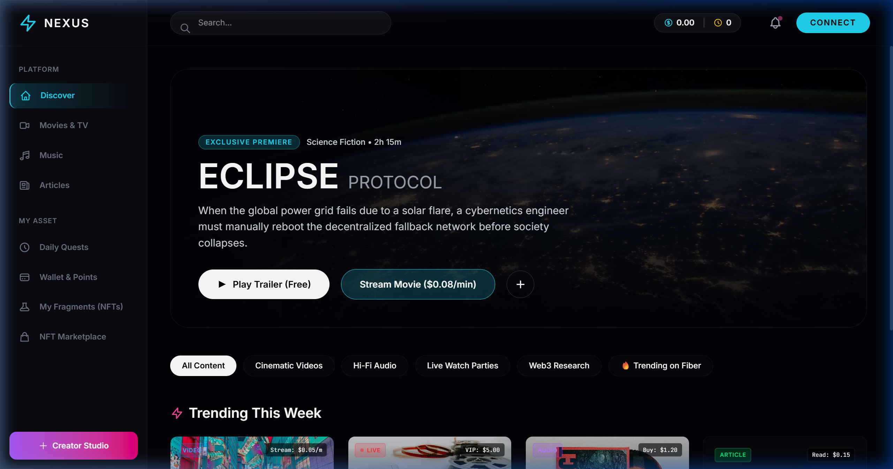
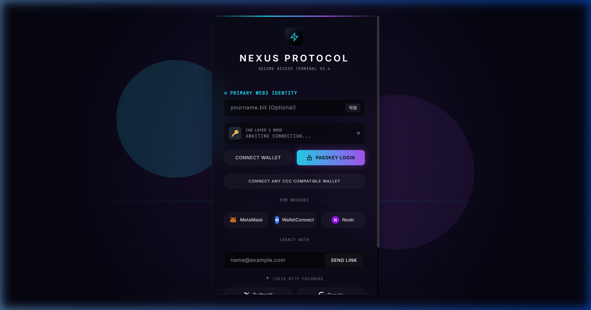

<p align="center">
  
</p>

<h1 align="center">⚡ Nexus Video Platform</h1>

<p align="center">
  <strong>Next-Gen Decentralized Content Platform — Video · Music · Article · Live · AI</strong>
</p>

<p align="center">
  <a href="#-what-is-nexus">About</a> •
  <a href="#-features-overview">Features</a> •
  <a href="#-architecture">Architecture</a> •
  <a href="#-web3-blockchain-integration">Web3</a> •
  <a href="#-ai-studio">AI Studio</a> •
  <a href="#-getting-started">Quick Start</a> •
  <a href="#-dev-automation">Dev Tools</a> •
  <a href="#-cicd-pipeline">CI/CD</a> •
  <a href="#-changelog">Changelog</a>
</p>

<p align="center">
  
  
  
  
  
  
  
  
</p>

---

## 📸 Screenshots

<p align="center">
  
  <br/>
  <em>Homepage — Cross-media content feed with per-second micropayments, AI tools, and live streaming</em>
</p>

<p align="center">
  
  <br/>
  <em>Web3 Login — JoyID Passkey, MetaMask, WalletConnect, Nostr, and traditional email authentication</em>
</p>

---

## 🎯 What is Nexus?

**Nexus** is a production-grade **full-stack decentralized content platform** that merges the user experience of YouTube, Spotify, and Medium with the ownership and payment infrastructure of Web3. Built on the **CKB (Nervos Network)** blockchain, it features:

- 🎬 **Per-second streaming payments** — Pay only for what you watch/listen, billed per second via Fiber Network L2
- 🎵 **Multi-format content** — Videos, music, articles, and live streams in one unified platform
- 🤖 **AI-powered creation** — Generate articles, music, and videos with integrated AI providers
- 🔐 **True content ownership** — Every piece of content can become an on-chain NFT via Spore Protocol
- 💰 **Automated revenue splits** — RGB++ isomorphic binding enables trustless multi-party royalty distribution
- 🆔 **Non-custodial identity** — JoyID Passkey login with no seed phrases required
- 🛒 **AI Tool Marketplace** — Decentralized marketplace for AI tools with NFT ownership and blockchain payments

---

## ✨ Features Overview

### 🎬 Content & Media

| Feature | Description |
|---------|-------------|
| **Video Streaming** | HLS adaptive playback with DRM ticket protection, per-second billing, and danmaku (弹幕) |
| **Music Player** | Full audio player with playlist management, global mini player, and cross-page playback |
| **Article Editor** | Rich text article creation with AI-assisted generation and on-chain publishing |
| **Live Streaming** | Real-time broadcasting via LiveKit with chat, danmaku, gifting, and PK battles |
| **Watch Party** | WebRTC synchronized co-watching with screen sharing, collaborative controls, and remote cursors |

### 💳 Payments & Economy

| Feature | Description |
|---------|-------------|
| **Per-Second Billing** | Fiber Network L2 micropayments — no subscriptions, pay only for what you consume |
| **Points System** | Platform currency with top-up (1 USDI = 100 PTS, 1 CKB = 10,000 PTS) |
| **Tipping & Gifts** | 10 gift types (❤️ to 🚀) with SVG visual effects and tip leaderboards |
| **Creator Revenue** | Automated royalty splits (70/20/10) via RGB++ smart contracts |
| **Daily Rewards** | Check-in system with streak multipliers (up to 7×), daily quests, and spin wheel |

### 🎨 NFT & Web3

| Feature | Description |
|---------|-------------|
| **Content NFTs** | 7 NFT categories via Spore Protocol: Ownership, Access Pass, Limited Edition, Creator Badge, etc. |
| **NFT Marketplace** | Browse, buy, and sell content NFTs with on-chain provenance |
| **Fragment Gallery** | Visual NFT collection showcase |
| **Achievement SBTs** | 18 non-transferable Soulbound Tokens across 5 categories |
| **DAO Governance** | Token-based proposals and voting (quorum 10k, threshold 50–67%) |

### 🤖 AI Studio

| Feature | Description |
|---------|-------------|
| **AI Article Lab** | AI-powered article generation with OpenAI, DeepSeek, Ollama |
| **AI Music Lab** | Music generation via Suno API with real-time progress tracking |
| **AI Video Lab** | Video generation via Runway Gen-4.5, Kling AI, and custom providers |
| **AI Settings** | BYOK (Bring Your Own Key) with AES-256 encryption and per-provider config |
| **AI Tool Marketplace** | Decentralized marketplace for AI tools — Spore NFT ownership + Fiber payments + RGB++ revenue splits |
| **AI Tool Submission** | 3-step creator wizard to publish tools: Info → Pricing → Tutorial & NFT |
| **AI Royalty Dashboard** | Revenue tracking with RGB++ split visualization |

### 👤 Social & Engagement

| Feature | Description |
|---------|-------------|
| **Creator Studio** | Full dashboard with analytics, content management, uploads, and contracts |
| **Channel Pages** | Customizable creator profiles with follower system |
| **Comments & Danmaku** | Nested comment threads + real-time bullet comments via SSE |
| **Messages** | WebSocket-based direct messaging with ntfy.sh push notifications |
| **Search** | Full-text search powered by MeiliSearch |
| **Live PK Battles** | 60-second scored competition mode between streamers |
| **Cross-Platform OAuth** | TikTok, YouTube, Bilibili, Twitter, Google (real OAuth 2.0 + PKCE) |
| **Onboarding Tour** | Interactive first-time user onboarding experience |

### 🤖 Agent-Native CLI (`nexus-cli`)

Inspired by [CLI-Anything](https://github.com/HKUDS/CLI-Anything) — dual-mode CLI (REPL + one-shot) with 8 command groups and 30+ subcommands:

```bash
npx tsx shared/cli/nexus-cli.ts                              # Interactive REPL
npx tsx shared/cli/nexus-cli.ts content list --limit 5 --json  # One-shot
npx tsx shared/cli/nexus-cli.ts ai orchestrate --prompt "..." --json
```

| Group | Commands |
|-------|----------|
| `auth` | login, logout, whoami |
| `content` | list, search (keyword + RAG), publish, delete |
| `ai` | orchestrate, rag-search, rag-index, skill-run, skill-match, cache-stats, tools-schema |
| `mcp` | tools-list, tools-call, resources-list, resources-read, prompts-list, prompts-get |
| `party` | create, list |
| `live` | rooms, create, tip, gifts |
| `user` | profile, balance, achievements |
| `system` | health, version |

---

## 🏗️ Architecture

Nexus follows a **microservices architecture** with 18 Fastify-based backend services, a React SPA frontend, and Docker-managed infrastructure.

```
┌──────────────────────────────────────────────────────────────────┐
│                   Client (React 18 + Vite 5)                      │
│                    http://localhost:5173                           │
│      65 Pages · 58+ Components · 15 Hooks · PWA Ready            │
└──────────────────────────┬───────────────────────────────────────┘
                           │
                           ▼
┌──────────────────────────────────────────────────────────────────┐
│               Identity / API Gateway (:8080)                      │
│      JWT Auth · Route Proxy · Circuit Breaker · Rate Limit        │
│      Consul Discovery · Per-User Abuse Detection                  │
└────┬────────┬────────┬────────┬────────┬────────┬────────┬──────┘
     │        │        │        │        │        │        │
     ▼        ▼        ▼        ▼        ▼        ▼        ▼
 ┌───────┐┌───────┐┌───────┐┌───────┐┌───────┐┌───────┐┌────────┐
 │Payment││Content││Meta-  ││Royalty││ NFT   ││ Live  ││  AI    │
 │ :8091 ││ :8092 ││ data  ││ :8094 ││ :8095 ││ :8096 ││  Gen   │
 │       ││       ││ :8093 ││       ││       ││       ││ :8105  │
 └───────┘└───────┘└───────┘└───────┘└───────┘└───────┘└────────┘
     │        │        │        │        │        │
     ▼        ▼        ▼        ▼        ▼        ▼
 ┌───────┐┌───────┐┌───────┐┌───────┐┌───────┐┌───────────────┐
 │Achieve││Govern-││Bridge ││Trans- ││Search ││ + 5 more      │
 │ :8097 ││ ance  ││ :8099 ││ code  ││ :8101 ││ Moderation    │
 │       ││ :8098 ││       ││ :8100 ││       ││ Messaging     │
 └───────┘└───────┘└───────┘└───────┘└───────┘│ Engagement    │
                                               │ Recommend     │
                                               │ Collaboration │
                                               └───────────────┘
     ┌──────────────────────────────────────────────────┐
     │           Infrastructure (Docker Compose)         │
     │  PostgreSQL 16 · Redis 7 · MinIO · MeiliSearch   │
     │  Consul · PgBouncer · Prometheus · Grafana        │
     └──────────────────────────────────────────────────┘
```

### 18 Microservices

| Port | Service | Responsibility |
|------|---------|----------------|
| **8080** | **Identity/Gateway** | JWT auth, route proxying, circuit breaking, JoyID/MetaMask/Email + OAuth (TikTok/YouTube/Bilibili) |
| **8091** | **Payment** | Points balance, CKB/USDI top-up, per-second stream billing, Fiber invoice clearing |
| **8092** | **Content** | Upload (Base64/TUS), HybridStorageEngine, DRM/HLS ticket generation, publish pipeline |
| **8093** | **Metadata** | Video/music/article metadata, danmaku (SSE), comments, trending, watchlists |
| **8094** | **Royalty** | RGB++ isomorphic binding revenue split execution, scheduled distributions |
| **8095** | **NFT** | Spore Protocol — 7 NFT types, minting, marketplace |
| **8096** | **Live** | LiveKit rooms, 10 gift types, PK battles, real-time viewer tracking |
| **8097** | **Achievement** | 18 condition-driven SBT achievements across 5 categories |
| **8098** | **Governance** | DAO proposals, token-weighted voting |
| **8099** | **Bridge** | Cross-chain asset bridging |
| **8100** | **Transcode** | Video transcoding via Livepeer |
| **8101** | **Search** | MeiliSearch-powered full-text search |
| **8102** | **Moderation** | Content moderation, text classification, and reporting |
| **8103** | **Messaging** | WebSocket DM system, ntfy.sh push notifications |
| **8104** | **Engagement** | Daily tasks, check-ins, spin wheel, anti-abuse rate limiting, fan level tracking |
| **8105** | **AI Generation** | AI content generation proxy (text/music/video), encrypted API key management |
| — | **Recommendation** | Thompson Sampling bandit + TF-IDF embeddings recommendation engine |
| — | **Collaboration** | Real-time collaborative editing |

### 3-Tier Hybrid Storage Engine

Progressive decentralization for content storage:

| Tier | Technology | Purpose | Latency |
|------|-----------|---------|---------|
| 🔴 **Hot** | MinIO (S3) | Instant playback | < 50ms |
| 🟡 **Warm** | Filecoin (IPFS) | Decentralized redundancy via web3.storage | ~ 2s |
| 🔵 **Cold** | Arweave | Permanent on-chain storage via Irys | ~ 30s |

### Shared Libraries (`shared/`)

| Module | Purpose |
|--------|---------|
| `web3/` | CKB, Fiber, Spore, RGB++, JoyID, Nostr, Arweave, Filecoin, ZKP, DAS, blockchain explorer |
| `storage/` | HybridStorageEngine, MinIO client, CDN, storage manifest |
| `payment/` | Payment provider abstraction (Credits, Fiber), payment hooks |
| `cache/` | Unified cache API with in-memory fallback and TTL support |
| `metrics/` | Prometheus-compatible metrics (counters/gauges/histograms) |
| `security/` | AES-256 token encryption, rate limiting, sensitive field redaction |
| `discovery/` | Consul service discovery and health-check registration |
| `cli/` | `nexus-cli` — agent-native CLI with 30+ commands |
| `queue/` | Redis-backed event bus for async inter-service messaging |
| `database/` | Prisma client with read-replica support |
| `resilience/` | Circuit breaker pattern for downstream call protection |

---

## 🔗 Web3 Blockchain Integration

### Protocols

| Protocol | Role | Implementation |
|----------|------|----------------|
| **[JoyID](https://joy.id)** | Passkey-based non-custodial wallet | `@joyid/ckb` — biometric auth, no seed phrases |
| **[Fiber Network](https://fiber.nervos.org)** | L2 micropayment channels | Per-second streaming payments, real-time billing |
| **[Spore Protocol](https://spore.pro)** | Content NFT standard | 7 categories of on-chain Digital Objects (DOBs) |
| **[RGB++](https://github.com/ckb-cell/rgbpp-sdk)** | Isomorphic binding | Trustless multi-party revenue distribution |
| **[.bit (d.id)](https://d.id)** | Decentralized identity | Human-readable addresses (e.g., `creator.bit`) |
| **[CCC](https://github.com/nicomen/ckb-ccc)** | Universal connector | Unified wallet abstraction for JoyID, MetaMask, UniSat |
| **[Nostr](https://nostr.com)** | Social protocol | Decentralized social identity bridging |

### Network Configuration

- **Blockchain**: CKB Testnet (`https://testnet.ckb.dev`)
- **Layer 2**: Fiber Network for off-chain payment channels
- **Storage**: MinIO → Filecoin → Arweave progressive pipeline

---

## 🤖 AI Studio

### Anthropic AI Course-Inspired Features

5 features inspired by [Anthropic Skilljar](https://courses.anthropic.com/) courses, applied to the platform:

| Feature | API Endpoint | Description |
|---------|-------------|-------------|
| **Tool Use — AI Orchestration** | `POST /ai/orchestrate` | Multi-tool auto-selection from natural language (5 built-in tools) |
| **RAG — Semantic Search** | `POST /ai/rag/search` | TF-IDF vectorization + cosine similarity search |
| **MCP Protocol** | `POST /ai/mcp/tools/*` | Model Context Protocol endpoints (tools, resources, prompts) |
| **Prompt Caching** | `POST /ai/cache/prompt` | LLM prompt cache with TTL, hit rate, and cost savings tracking |
| **Agent Skills** | `POST /ai/skills/run` | 3 built-in skills: content-review, seo-optimizer, royalty-calculator |

### AI Content Generation

| Lab | Provider | Capabilities |
|-----|----------|-------------|
| **Article Lab** | OpenAI, DeepSeek, Ollama | Multi-model article generation with local storage |
| **Music Lab** | Suno API | Music generation with real-time progress tracking |
| **Video Lab** | Runway Gen-4.5, Kling AI | Video generation with publish-to-platform pipeline |

### AI Tool Marketplace

- Browse, search, filter AI tools across **10 categories**
- Creator submission wizard (3-step: Info → Pricing → Tutorial & NFT)
- Revenue split model: **70% Creator / 20% Platform / 10% Referrer** via RGB++
- Optional Spore NFT minting for tool ownership

---

## 🔒 Security & Stability

| Feature | Description |
|---------|-------------|
| **Token Encryption** | AES-256-CBC for JWT at rest, machine-unique key derivation |
| **Per-User Rate Limiting** | Sliding window: 60 req/min per user, abuse detection with 5-min ban |
| **API Abstraction** | All 27 API paths centralized in `ROUTES` map |
| **File Permissions** | Token files restricted to `0o600` (owner-only) |
| **Sensitive Redaction** | Automatic redaction in CLI output (token, password, apiKey, etc.) |
| **Circuit Breaker** | Downstream call protection with automatic recovery |

---

## 🛠️ Tech Stack

### Frontend
| Technology | Purpose |
|-----------|---------|
| React 18 + TypeScript 5.5 | UI framework |
| Vite 5 | Build tool with HMR |
| Zustand | State management (Auth, Points, UI stores) |
| React Query | Data fetching (64+ hooks) |
| Three.js | 3D virtual rooms for Watch Party |
| Video.js | Adaptive video player |
| react-i18next | Internationalization (EN/ZH) |
| WebRTC | Peer-to-peer screen sharing and Watch Party |

### Backend
| Technology | Purpose |
|-----------|---------|
| Fastify 4 | High-performance HTTP framework |
| Prisma 5 | Type-safe ORM with PostgreSQL |
| BullMQ | Redis-backed job queue |
| Pino | Structured logging |
| Consul | Service discovery |

### Infrastructure
| Technology | Purpose |
|-----------|---------|
| PostgreSQL 16 | Primary database (30+ Prisma models) |
| Redis 7 | Caching, sessions, rate limiting, pub/sub |
| MinIO | S3-compatible object storage |
| MeiliSearch | Full-text search engine |
| LiveKit | WebRTC live streaming |
| Livepeer | Decentralized video transcoding |
| Prometheus + Grafana | Metrics and monitoring (7-panel dashboard) |
| Docker Compose | Container orchestration |

---

## 🚀 Getting Started

### Prerequisites

- **Node.js** >= 18 (v20 recommended)
- **Docker Desktop** (running)
- **Git**

### 1. Clone & Install

```bash
git clone https://github.com/alefnt/nexus-video-platform.git
cd nexus-video-platform/video-platform
npm install
```

### 2. Configure Environment

```bash
# Copy the example environment file
cp .env.example .env.local

# Create Docker secrets directory
mkdir .secrets
echo "nexus_dev_2024" > .secrets/db_password
echo "your_jwt_secret_here" > .secrets/jwt_secret
echo "nexus_meili_dev_key" > .secrets/meili_key
echo "nexus_minio_2024" > .secrets/minio_password
```

### 3. Start Infrastructure

```bash
# Start PostgreSQL, Redis, MinIO, MeiliSearch
docker compose up -d
```

### 4. Initialize Database

```bash
# Push Prisma schema to database
npx dotenv -e .env.local -- npx prisma db push \
  --schema packages/database/prisma/schema.prisma

# Generate Prisma client
npx dotenv -e .env.local -- npx prisma generate \
  --schema packages/database/prisma/schema.prisma
```

### 5. Start Services

```bash
# Option A: One-click startup (Windows — recommended)
npm start

# Option B: Manual startup
npm run dev:services    # Start all backend services
npm run dev:web         # Start frontend (in a new terminal)
```

### 6. Open the App

Visit **http://localhost:5173** in your browser. 🎉

---

## 🔧 Dev Automation

One-click development scripts for common operations:

| Command | Description |
|---------|-------------|
| `npm start` | One-click startup: kill ports → Docker → deps → Prisma → all services |
| `npm stop` | Stop all services and optionally Docker containers |
| `npm restart` | Restart services (keeps Docker running) |
| `npm run health` | Check health of all 18 services + Docker containers |
| `npm run db:migrate` | Run Prisma migrations |
| `npm run db:reset` | Reset database (destructive) |
| `npm run db:seed` | Seed database with sample data |
| `npm run db:studio` | Open Prisma Studio GUI |
| `npm run lint` | Run ESLint on the entire project |
| `npm run format` | Format all files with Prettier |
| `npm run cli` | Launch nexus-cli in REPL mode |

### Version Release

```powershell
# Automated: bump version, update CHANGELOG, create tag, push
powershell -File scripts/release.ps1 -Version "2.9.0"
```

---

## 🔄 CI/CD Pipeline

6-stage GitHub Actions pipeline triggered on push to `main`/`develop` and version tags:

```
┌─────────┐    ┌─────────┐    ┌─────────┐    ┌──────────┐    ┌────────┐    ┌─────────┐
│ Quality │───▶│  Test   │───▶│  Build  │───▶│ Security │───▶│ Docker │───▶│ Release │
│  Lint   │    │  Unit   │    │ Client  │    │  Audit   │    │  Build │    │ GitHub  │
│  Types  │    │ Postgres│    │  Vite   │    │ npm audit│    │  (tag) │    │  (tag)  │
└─────────┘    │  Redis  │    └─────────┘    └──────────┘    └────────┘    └─────────┘
               └─────────┘
```

- **Test services**: PostgreSQL 16 + Redis 7 in CI
- **Auto-release**: Triggered on `v*` tags with generated release notes

---

## 📁 Project Structure

```
nexus-video-platform/video-platform/
├── client-web/                  # React SPA (Vite 5)
│   └── src/
│       ├── pages/               # 65 page components
│       ├── components/          # 58+ reusable components (49 files + 9 dirs)
│       ├── hooks/               # 15 custom React hooks
│       ├── lib/                 # 16 utility modules (payments, analytics, i18n, etc.)
│       ├── stores/              # Zustand state stores
│       ├── contexts/            # React context providers
│       └── i18n/                # Internationalization resources
├── services/                    # 18 Fastify microservices
│   ├── identity/                # Auth gateway (:8080) + OAuth routes
│   ├── payment/                 # Payments & billing (:8091) + tests
│   ├── content/                 # Upload & storage (:8092)
│   ├── metadata/                # Content metadata (:8093)
│   ├── royalty/                 # Revenue splits (:8094)
│   ├── nft/                     # NFT minting (:8095)
│   ├── live/                    # Live streaming (:8096)
│   ├── achievement/             # SBT achievements (:8097)
│   ├── governance/              # DAO voting (:8098)
│   ├── ai-generation/           # AI content proxy (:8105)
│   ├── recommendation/          # ML recommendation engine
│   └── ...                      # + 7 more services
├── shared/                      # Shared libraries (22 modules)
│   ├── web3/                    # 11 blockchain integrations
│   ├── storage/                 # Hybrid storage engine
│   ├── cache/                   # Redis cache with in-memory fallback
│   ├── metrics/                 # Prometheus metrics
│   ├── security/                # Token encryption & rate limiting
│   ├── discovery/               # Consul service discovery
│   ├── cli/                     # nexus-cli (30+ commands)
│   └── ...                      # + 15 more shared modules
├── packages/database/           # Prisma schema (30+ models, 1176 lines)
├── contracts/                   # RGB++ smart contracts (Rust/Cargo)
├── scripts/                     # 13 dev automation scripts
├── deploy/                      # Docker, Consul, Nginx, Prometheus, Grafana configs
├── design/                      # UI design mockups (Gemini 3 generated)
├── monitoring/                  # Grafana dashboard + Prometheus config
├── tests/                       # E2E (Playwright), integration, load (k6), unit tests
├── docker-compose.yml           # Development infrastructure
├── CHANGELOG.md                 # Detailed version history
└── .github/workflows/ci.yml    # 6-stage CI/CD pipeline
```

---

## 📊 Key Metrics

| Metric | Value |
|--------|-------|
| **Microservices** | 18 |
| **Frontend Pages** | 65 |
| **UI Components** | 58+ |
| **Custom Hooks** | 15 |
| **Lib Modules** | 16 |
| **Shared Modules** | 22 |
| **Prisma Models** | 30+ |
| **CLI Commands** | 30+ |
| **NFT Categories** | 7 |
| **Achievement Types** | 18 |
| **Gift Types** | 10 |
| **AI Tool Categories** | 10 |
| **OAuth Providers** | 6 (JoyID, Twitter, Google, TikTok, YouTube, Bilibili) |
| **Dev Scripts** | 13 |
| **CI/CD Stages** | 6 |
| **Languages** | TypeScript (100%) |

---

## 🧪 Testing

```bash
# Service unit tests
npm run test:services

# E2E tests (Playwright — installs browsers automatically)
npm run test:e2e

# E2E smoke tests (lightweight, no browser needed)
npx tsx tests/e2e/smoke.test.ts

# Load testing (k6)
k6 run tests/load/k6-load-test.js
```

---

## 📋 Business Automation Pipelines

| Pipeline | Trigger | Actions |
|----------|---------|---------|
| **Content Lifecycle** | `POST /content/publish` | Upload → Metadata → NFT Mint → RGB++ Royalty Contract |
| **AI → Publish** | AI Lab "Publish" button | AI Generate → Base64 Convert → Pipeline Publish → NFT |
| **Auto-Moderation** | Content publish | Text classification → Auto-approve/flag |
| **Achievement Detection** | Content upload | Stats increment → Achievement check → SBT mint |
| **Royalty Distribution** | Cron (60s) | Find due distributions → RGB++ execute → Status update |
| **Daily Task Auto-Claim** | Task completion | Verify requirement → Auto-award points → No manual claim |
| **Fan Engagement** | User action webhook | Rate-limit → Task progress → Fan level → Achievement |
| **AI Tool Marketplace** | Tool submission | Auto-approve → NFT mint → Marketplace listing |

---

## 📜 Changelog

See [CHANGELOG.md](CHANGELOG.md) for a detailed version history.

### Highlights

- **v2.8.0** — E2E smoke tests, CI/CD pipeline, Redis cache layer, component splitting, Prometheus metrics, security hardening, agent-native CLI
- **v2.2.0** — Daily spin wheel overhaul, sidebar restructure, My AI Tools dashboard
- **v2.1.0** — AI Studio (Article/Video/Music Labs), AI Tool Marketplace, OAuth integration
- **v2.0.0** — Full UI implementation, cross-media feeds, Watch Party, NFT marketplace, per-second payments
- **v1.0.0** — Initial video platform with basic auth

---

## 📄 License

This project is licensed under the **MIT License**.

---

<p align="center">
  Built with ⚡ on <a href="https://www.nervos.org/">Nervos CKB</a> · Powered by <a href="https://fiber.nervos.org">Fiber Network</a> · NFTs via <a href="https://spore.pro">Spore Protocol</a>
</p>
