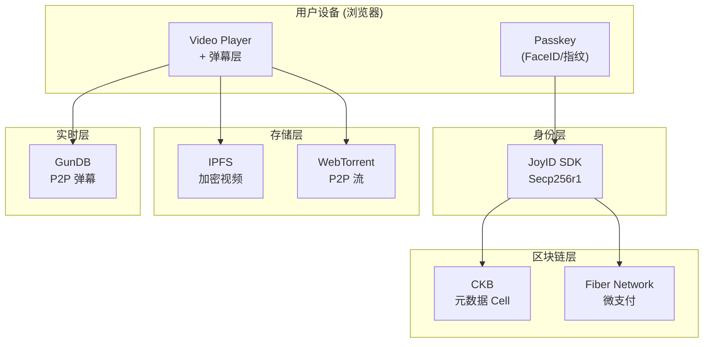
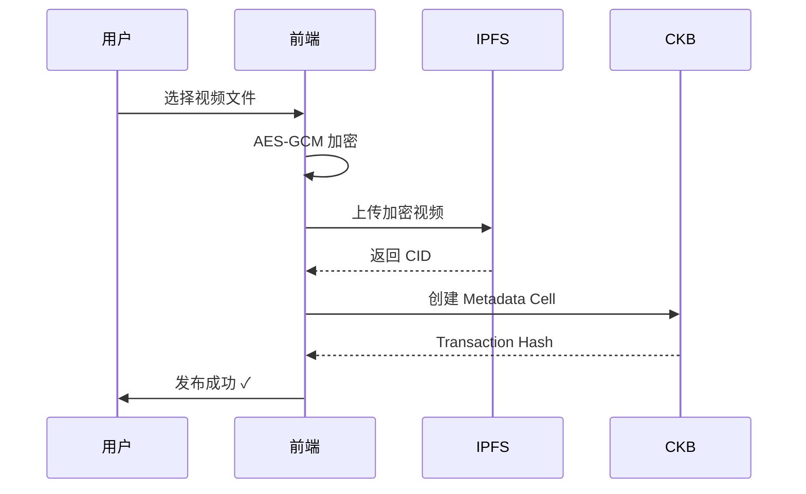
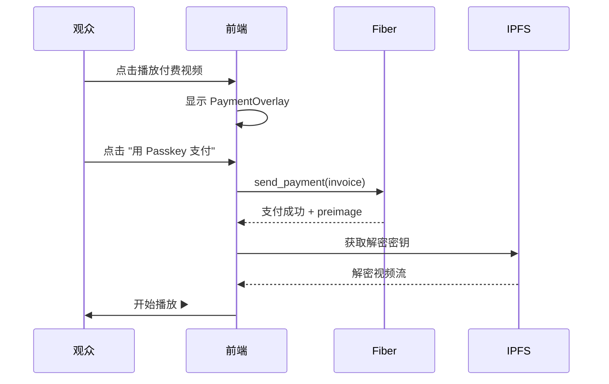

# Nexus Video 架构文档

> "You pay the creator — not the platform."

---

## 系统分层



---

## 层级说明

| 层级 | 组件 | 职责 | 输入 | 输出 |
|------|------|------|------|------|
| **身份层** | JoyID SDK | 派生 Secp256r1 地址 | Apple ID / Google 账号 | CKB 地址、签名能力 |
| **区块链层** | CKB + Fiber | 支付结算、元数据锚定 | 视频元数据、支付请求 | Transaction Hash |
| **存储层** | IPFS + WebTorrent | 视频加密存储与分发 | 加密视频文件 | IPFS CID、P2P 流 |
| **实时层** | GunDB | 弹幕广播 | 弹幕文本 | P2P 同步消息 |
| **前端层** | React + Vite | UI 渲染与交互 | 用户操作 | 视觉反馈 |

---

## 项目结构

```
video-platform/
├── client-web/                  # React 前端
│   ├── src/
│   │   ├── components/          # UI 组件
│   │   │   ├── BottomTabBar.tsx     # 移动端导航
│   │   │   ├── CommentSection.tsx   # 评论/社交
│   │   │   ├── CreatorToolbar.tsx   # 桌面工具栏
│   │   │   ├── DanmakuLayer.tsx     # GunDB 弹幕
│   │   │   ├── P2PStatus.tsx        # P2P 状态
│   │   │   ├── ParticleBackground.tsx # 粒子动画
│   │   │   ├── PaymentOverlay.tsx   # 付费解锁
│   │   │   ├── TopNav.tsx           # 顶部导航
│   │   │   └── VideoCard.tsx        # 视频卡片
│   │   ├── lib/                 # 工具库
│   │   │   ├── ipfs.ts              # IPFS 集成
│   │   │   └── webtorrent.ts        # WebTorrent 集成
│   │   ├── pages/               # 页面
│   │   │   ├── Home.tsx             # 首页
│   │   │   ├── Login.tsx            # 登录/Onboarding
│   │   │   ├── Profile.tsx          # 个人主页
│   │   │   ├── VideoFeed.tsx        # 视频 Feed
│   │   │   ├── VideoPlayer.tsx      # 播放器
│   │   │   └── CreatorUpload.tsx    # 上传页
│   │   └── styles/
│   │       └── fun.css              # Cyberpunk 主题
│   └── package.json
├── shared/                      # 共享代码
│   ├── web3/
│   │   └── fiber.ts                 # Fiber RPC 客户端
│   ├── api/
│   │   └── client.ts                # API 客户端
│   └── types/
│       └── index.ts                 # 类型定义
└── services/                    # 后端服务
    ├── identity/                    # 身份认证
    ├── content/                     # 内容管理
    └── payment/                     # 支付结算
```

---

## 数据流

### 视频上传流程



### 付费观看流程



---

## 技术栈

| 类别 | 技术 |
|------|------|
| 前端 | React 18, Vite, TypeScript |
| 样式 | Vanilla CSS (Cyberpunk 主题) |
| 视频 | video.js, HLS.js |
| 身份 | JoyID SDK (@joyid/ckb) |
| 存储 | IPFS, WebTorrent |
| 实时 | GunDB |
| 区块链 | CKB, Fiber Network |
| 后端 | Fastify, SQLite |

---

## 环境变量

```env
# 前端
VITE_API_GATEWAY_URL=http://localhost:3001
VITE_JOYID_APP_URL=https://testnet.joyid.dev

# 后端
FIBER_RPC_URL=http://18.163.221.211:8227
CKB_RPC_URL=https://testnet.ckb.dev
```